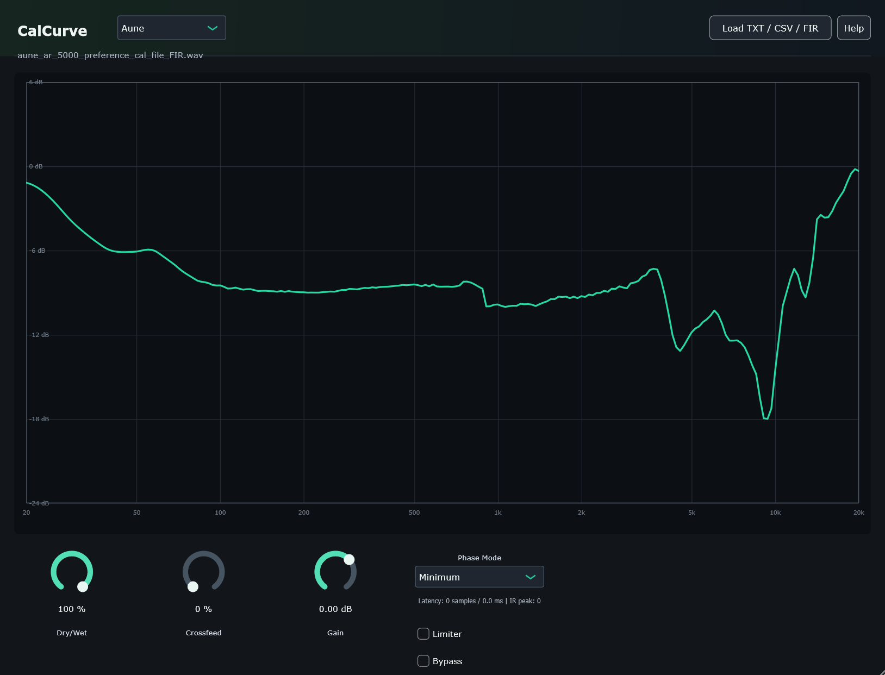

# CalCurve

CalCurve loads local headphone calibration files and applies them as convolution correction. It accepts FIR WAV files directly, or TXT/CSV correction curves which are converted internally to FIR.



The tool is intentionally narrow: it does not include a headphone database, headphone simulation, or target selection. It assumes the loaded file is already an exported/calibrated correction curve.

## Supported Formats

- WAV FIR impulse responses
- Frequency/dB TXT files separated by tabs, spaces, commas, or semicolons
- Equalizer APO / Wavelet `GraphicEQ:` text files
- APO CSV correction curves
- Melda FreeForm EQ CSV exports
- Equalizer APO parametric EQ text files

## Controls

- **Dry/Wet:** blends the original signal with the corrected signal.
- **Crossfeed:** stereo crossfeed for headphone listening.
- **Gain:** final output trim in dB.
- **Phase Mode:** selects the FIR phase engine.
  - **Minimum:** causal minimum-phase FIR, zero reported latency.
  - **Natural:** mixed-phase FIR with 1024 samples of latency and reduced pre-ringing.
  - **Linear:** symmetric linear-phase FIR with 4096 samples of latency and flat phase.
- **Auto Gain:** hidden internal compensation. When a curve or FIR is loaded, CalCurve estimates the perceived K-weighted loudness change and applies compensation to the corrected wet path. This keeps Dry/Wet and Bypass A/B comparisons closer in perceived level without moving the Gain knob.
- **Limiter:** safety limiter to reduce accidental clipping.
- **Load TXT / CSV / FIR:** opens a local calibration file.
- **Help:** opens the in-plugin reference window.

## Presets

The `Presets` menu lets you select, save, and delete user presets from inside the plugin.

- `Select user preset...` is the default empty menu entry.
- Existing presets appear below it.
- `Save current preset...` asks for a preset name and writes a `.calcurvepreset` file.
- `Delete current preset...` deletes the currently loaded custom preset.

On Windows, user presets are stored in the application data folder:

```text
%APPDATA%\Mixomo\CalCurve\UserPresets\
```

CalCurve creates this folder automatically when the presets menu is used.

A preset stores:

- Dry/Wet, Crossfeed, Gain, Phase Mode, Limiter, and Bypass state
- the custom preset name
- the path to the loaded calibration file
- the loaded file label shown in the interface
- an embedded copy of the loaded correction curve as frequency/dB points

When a preset is loaded, CalCurve first tries to reload the original file from the saved path. If the file is still there, it uses the file so the preset follows any deliberate updates you made to that calibration.

If the original file is missing, renamed, or moved, CalCurve falls back to the embedded frequency/dB curve stored inside the preset and rebuilds the FIR from that. This makes presets portable and keeps them useful even when the original calibration file is no longer available.

For WAV FIR files, the preset embeds the magnitude curve extracted from the WAV, not the raw WAV samples. The selected Phase Mode still regenerates the active FIR from that embedded curve.

## Graph

- The green line is the loaded calibration curve scaled by Dry/Wet.
- The 0 dB line remains the reference.
- The dB range expands or contracts around 0 dB to fit each loaded curve.
- At 0% Dry/Wet the line becomes flat.
- At 100% Dry/Wet it shows the full correction.

## Phase Engines

CalCurve regenerates the active FIR whenever the phase mode changes.

- TXT and CSV files are parsed into a correction curve, then converted to FIR using the selected phase engine.
- WAV FIR files are converted to a magnitude curve, then regenerated into the selected phase engine so Minimum, Natural, and Linear remain consistent.
- The plugin reports latency changes to the host when the mode changes.

Measured test values at 48 kHz:

| Mode | FIR Type | Peak / Latency |
| --- | --- | --- |
| Minimum | Minimum phase | ~0 samples |
| Natural | Mixed phase | 1024 samples |
| Linear | Linear phase | 4096 samples |

Some DAWs may compensate plugin delay during playback or monitoring. The plugin GUI shows the active reported latency and FIR peak to make the selected mode visible.

## Copy / Install CalCurve VST3

You do not need to build CalCurve just to use the plugin.

For normal installation, download the release asset from GitHub Releases:

```text
CalCurve.zip
```

Extract it and copy the included `CalCurve.vst3` bundle.

The ready-to-copy VST3 bundle is included at:

```text
Convolver_VST/CalCurve_VST3/CalCurve.vst3
```

On Windows, copy the full `CalCurve.vst3` bundle to your system VST3 folder:

```text
C:\Program Files\Common Files\VST3\
```

You may need administrator permission to write to that folder. After copying, rescan plugins in your DAW.

## Building

CalCurve is a JUCE CMake project. JUCE is not vendored in this repository, so CMake needs to know where your local JUCE checkout is through the `JUCE_DIR` option.

Requirements:

- CMake 3.22 or newer
- A C++20-capable compiler
- A local JUCE checkout
- On Windows, Visual Studio 2022 with the MSVC C++ toolchain

Example folder layout:

```text
C:\Dev\
  CalCurve\
  JUCE\
```

From the `CalCurve` repository folder, configure the build with a generic local JUCE path:

```powershell
cmd /c "call ""C:\Program Files\Microsoft Visual Studio\2022\Community\Common7\Tools\VsDevCmd.bat"" -arch=x64 && cmake -S . -B build -G ""NMake Makefiles"" -DJUCE_DIR=""C:\Dev\JUCE"" -DCMAKE_BUILD_TYPE=Release"
```

Build the VST3 plugin and the smoke test executable:

```powershell
cmd /c "call ""C:\Program Files\Microsoft Visual Studio\2022\Community\Common7\Tools\VsDevCmd.bat"" -arch=x64 && cmake --build build --target CalCurve_VST3 CalCurveVST3SmokeTest"
```

What the configure command does:

- `-S .` uses the current repository as the source directory.
- `-B build` writes all generated CMake/build files to `build`.
- `-G "NMake Makefiles"` selects the NMake generator.
- `-DJUCE_DIR="C:\Dev\JUCE"` points CMake to your JUCE checkout. Replace this with your own JUCE path.
- `-DCMAKE_BUILD_TYPE=Release` creates a Release build.

What the build command does:

- `CalCurve_VST3` builds the VST3 plugin.
- `CalCurveVST3SmokeTest` builds the minimal command-line VST3 host/test tool.

Expected local build outputs:

```text
build/CalCurve_artefacts/Release/VST3/CalCurve.vst3
build/CalCurveVST3SmokeTest_artefacts/Release/CalCurveVST3SmokeTest.exe
```

## Smoke Test

The repository includes `CalCurveVST3SmokeTest`, a small command-line VST3 host used to confirm that the built plugin can be discovered, instantiated, opened, and processed.

All commands below assume you are running them from the repository root after building.

Basic plugin load and process test:

```powershell
.\build\CalCurveVST3SmokeTest_artefacts\Release\CalCurveVST3SmokeTest.exe `
  .\build\CalCurve_artefacts\Release\VST3\CalCurve.vst3
```

This checks:

- VST3 discovery
- plugin description parsing
- instance creation
- editor availability
- one empty audio `processBlock`

Briefly open the editor:

```powershell
.\build\CalCurveVST3SmokeTest_artefacts\Release\CalCurveVST3SmokeTest.exe `
  .\build\CalCurve_artefacts\Release\VST3\CalCurve.vst3 `
  --editor
```

This creates the plugin editor, shows it for a few seconds, then closes it.

Round-trip plugin state/preset data:

```powershell
.\build\CalCurveVST3SmokeTest_artefacts\Release\CalCurveVST3SmokeTest.exe `
  .\build\CalCurve_artefacts\Release\VST3\CalCurve.vst3 `
  --preset-roundtrip
```

This saves the plugin state to a temporary `.calcurvepreset` file, reloads it, and confirms the state path works without crashing.

Curve/FIR phase validation using a generic local TXT or CSV correction curve:

```powershell
.\build\CalCurveVST3SmokeTest_artefacts\Release\CalCurveVST3SmokeTest.exe `
  .\build\CalCurve_artefacts\Release\VST3\CalCurve.vst3 `
  --fir-test "C:\Path\To\Your\CalibrationCurve.txt"
```

You can replace the last path with any supported TXT or CSV correction curve.

This prints:

- parsed curve point count
- Auto Gain estimate
- generated FIR peak values
- expected and measured peak/latency positions for Minimum, Natural, and Linear phase
- measured `juce::dsp::Convolution` output peak position
- average magnitude error against the loaded curve

Inspect a WAV FIR file:

```powershell
.\build\CalCurveVST3SmokeTest_artefacts\Release\CalCurveVST3SmokeTest.exe `
  .\build\CalCurve_artefacts\Release\VST3\CalCurve.vst3 `
  --wav-fir-test "C:\Path\To\Your\ImpulseResponse.wav"
```

This reads a WAV impulse response, extracts its magnitude curve, estimates Auto Gain, and reports basic FIR information.

## Credits

- **Development:** Ezequiel Casas (Mixomo)  
  [https://github.com/Mixomo](https://github.com/Mixomo)
- **Example curves:**  
  [https://github.com/Mixomo/My-Headphones-Calibration-Files](https://github.com/Mixomo/My-Headphones-Calibration-Files)
- **More calibration curves:**  
  [https://autoeq.app/](https://autoeq.app/)
- **Thanks and credit to Jaakko Pasanen:**  
  [https://github.com/jaakkopasanen](https://github.com/jaakkopasanen)
- **AutoEq:**  
  [https://github.com/jaakkopasanen/AutoEq](https://github.com/jaakkopasanen/AutoEq)
- **squig.link:**  
  [https://squig.link/](https://squig.link/)
- **MeldaProduction:**  
  [https://www.meldaproduction.com/](https://www.meldaproduction.com/)
- **Steinberg / VST3 SDK:**  
  [https://github.com/steinbergmedia/vst3sdk](https://github.com/steinbergmedia/vst3sdk)
- **JUCE:**  
  [https://juce.com/](https://juce.com/)
- **Microsoft MSVC / Visual Studio C++ toolchain:**  
  [https://microsoft.com/](https://microsoft.com/)
- **C++ language created by Bjarne Stroustrup**

## License

- **CalCurve:** GNU General Public License v3.0 (GPLv3). See [LICENSE](LICENSE).
- **VST3 SDK components:** MIT License, copyright Steinberg Media Technologies GmbH.
- **JUCE framework:** AGPLv3/commercial licensing.

See [THIRD_PARTY_NOTICES.md](THIRD_PARTY_NOTICES.md) for third-party notices.
