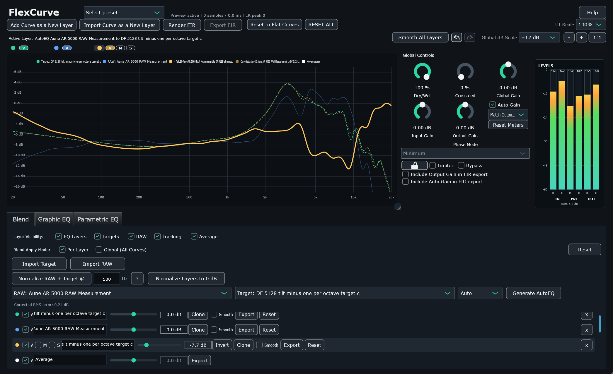
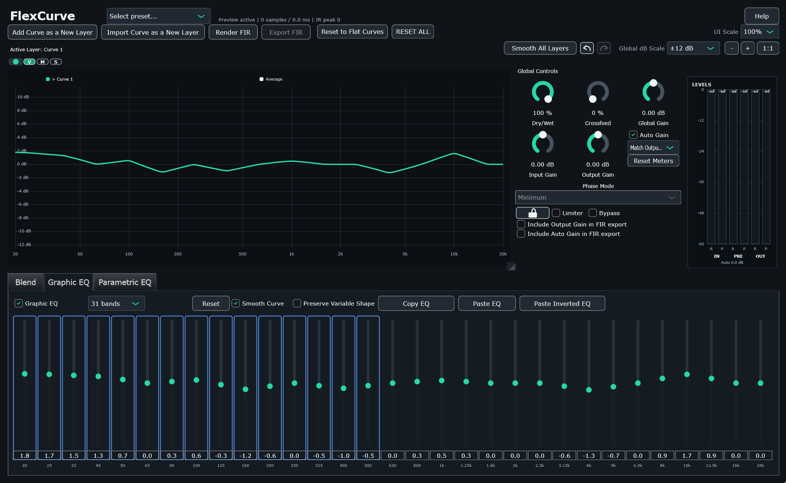
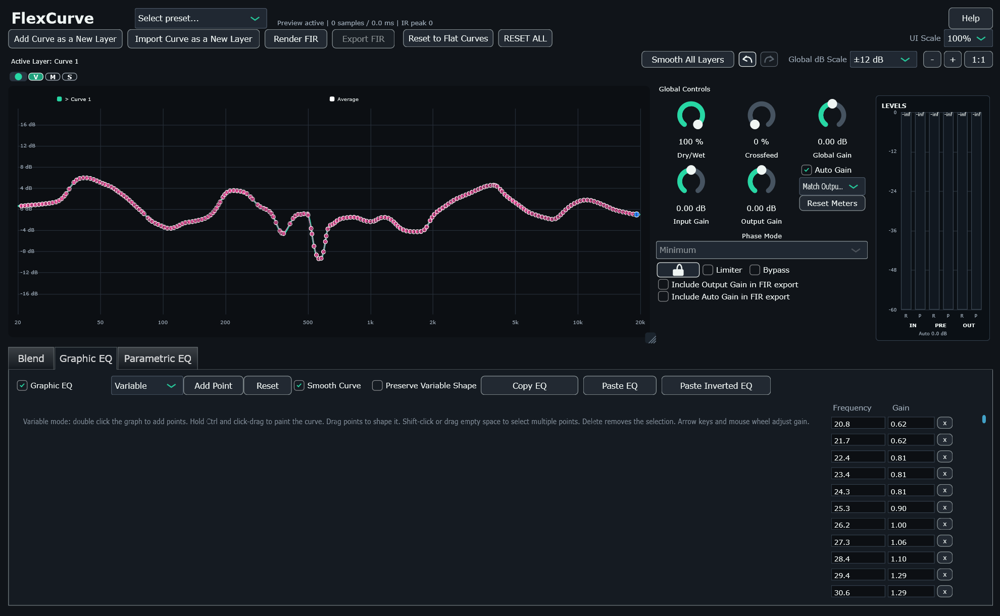
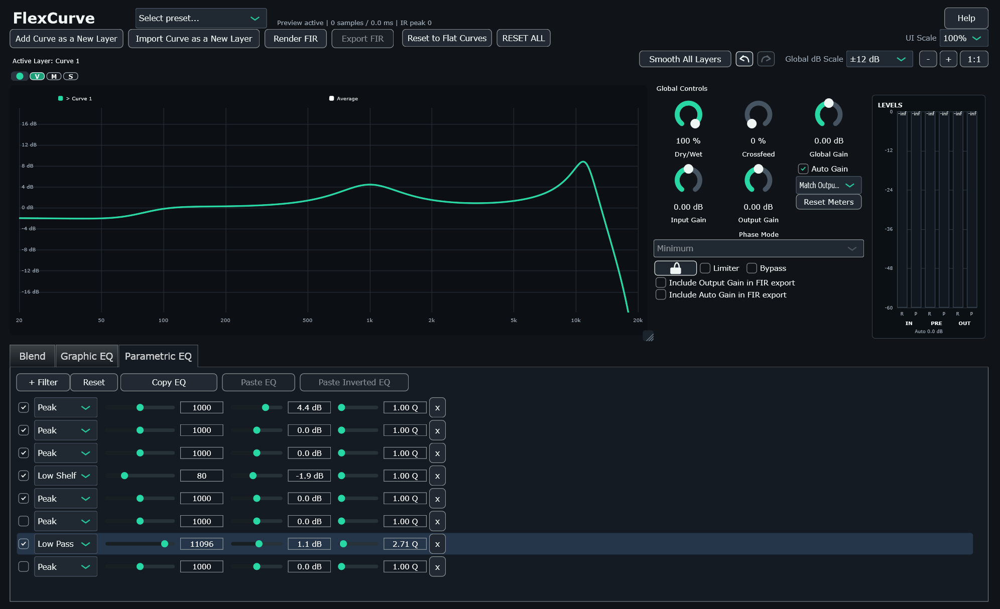
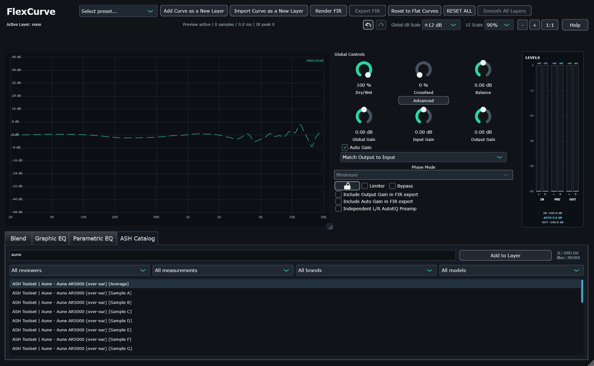

# FlexCurve

FlexCurve is a VST3 headphone-correction curve editor and FIR renderer. It imports local TXT, CSV, and WAV FIR calibrations, and also includes an embedded offline ASH Toolset/reviewer catalog that can be previewed or added as editable layers. FlexCurve previews changes in real time, blends active layers into an Average curve, and renders the result as a Minimum, Natural, or Linear phase FIR.

CalCurve is the simpler companion plugin for finished correction curves: load one TXT/CSV/FIR calibration and apply it directly.
CalCurve lives at [github.com/Mixomo/CalCurve](https://github.com/Mixomo/CalCurve).







## Copy / Install FlexCurve VST3

You do not need to build FlexCurve to use it.

1. Download `FlexCurve.zip` from the Releases section.
2. Extract the ZIP.
3. Copy the complete `FlexCurve.vst3` folder to:

```text
C:\Program Files\Common Files\VST3\
```

The repository also includes the ready-to-copy bundle at:

```text
FlexCurve_VST3/FlexCurve.vst3
```

Copy the whole `.vst3` bundle, not only the binary inside it, then rescan VST3 plugins in the DAW.

## FIR And Convolution

An FIR (finite impulse response) is a filter represented by a short audio-like impulse. Convolution applies that impulse to the audio signal. A frequency/dB curve describes the desired magnitude correction; the FIR is the filter that performs it.

Compared with a simple static gain-at-frequency curve, a rendered FIR can:

- reproduce a dense correction continuously across the spectrum
- preserve a repeatable response between supported host sample rates
- encode Minimum, Natural, or Linear phase behavior from the same magnitude target
- provide deterministic convolution suitable for export to another convolver

FlexCurve reads WAV FIR files as magnitude responses and regenerates them internally at the current host sample rate. TXT and CSV curves enter the same internal frequency/dB model before preview or FIR rendering.

When a text/APO curve declares a global `Preamp` or gain directive, FlexCurve separates that value from the curve geometry and places it in the layer Gain control. FlexCurve-exported FIR WAV files store the same layer gain in WAV metadata, so reimporting them restores the editable gain without applying it twice. External FIR files without explicit FlexCurve gain metadata retain their measured magnitude response and use a safe default layer gain of `0.0 dB`; FlexCurve does not guess or destructively normalize their level.

## Current Build State

As of July 16, 2026, the FlexCurve branch contains the current VST3-only release candidate:

- non-destructive EQ, Target, and RAW layer editing with up to six user EQ layers
- independent L/R layer state, channel selection, linking, split-channel render/export, and per-layer balance trim
- embedded offline ASH Toolset and reviewer-compilation headphone-correction catalog
- live Minimum-phase FIR preview with rendered Minimum, Natural, and Linear phase modes
- Graphic EQ 15-band, 31-band, and Variable point editing with copy/paste rules across modes and layers
- Parametric EQ with an unrestricted scrollable filter list
- AutoEQ generation from Target and RAW references with corrected-measurement tracking
- Advanced Crossfeed window with Natural and BS2B/RME-style algorithms
- global Dry/Wet, Crossfeed, Balance, Input Gain, Output Gain, Global Gain, Auto Gain, Limiter, and Bypass
- dynamic IN, PRE, and OUT meter display with live peak/RMS readouts and fixed Auto Gain compensation status
- project presets with embedded curve data, CalCurve preset migration, and ready-to-copy VST3 bundle output

## Supported Imports

- WAV FIR impulse responses
- Frequency/dB TXT separated by tabs, spaces, commas, or semicolons
- Equalizer APO and Wavelet GraphicEQ text
- Equalizer APO CSV correction curves
- Melda FreeForm EQ CSV exports
- Equalizer APO parametric EQ text
- Stereo frequency/dB text rows in `frequency left_dB right_dB` form
- Separate `Preamp L` / `Preamp R` or `Left Gain` / `Right Gain` directives
- Embedded offline ASH Toolset and reviewer-compilation HpCF catalog entries from the **ASH Catalog** tab. The ASH source catalog comes from [ShanonPearce/ASH-Toolset](https://github.com/ShanonPearce/ASH-Toolset).

## Layers And Blend

FlexCurve starts with an empty graph. Use:

- **Import Curve as a New Layer** to load TXT, CSV, WAV, or FIR files
- **Add Curve as a New Layer** to create a flat editable layer
- **ASH Catalog** to search the embedded offline ASH Toolset and reviewer-compilation headphone-correction databases. The ASH source catalog comes from [ShanonPearce/ASH-Toolset](https://github.com/ShanonPearce/ASH-Toolset). Use the master search plus Reviewer/Measurement, Brand, and Model dropdown filters. The list shows each calibration with its reviewer. **Add to Layer** imports it as a normal editable layer; double-click auditions it through a hidden preview-only FIR path and draws it as a long-dashed, isolated `PREVIEW` curve without changing Average, layers, render, export, or presets.

Up to six user layers can coexist. Every layer stores its source curve, color, custom name, visibility, mute, solo, gain, Blend settings, Graphic/Variable EQ, and Parametric EQ.

**Clone** duplicates a layer with its embedded curve, both fixed Graphic EQ banks, Variable points, Parametric filters, Blend settings, smoothing, inversion, and visibility state. The clone receives a new identity and color.

The compact layer rack remains visible in every tab:

- click the colored circle to make that layer active
- **V** shows or hides it in the graph
- **M** removes it from audio and from the Average calculation
- **S** restricts audio and Average to soloed layers
- **x** deletes the layer directly from the rack without returning to the Blend tab
- hover the color circle to see the complete layer name

The graph legend also selects layers. The active-layer text is informational and always shows the full active name.

The white **Average** curve is read-only and derived live from audible source layers. It is the result used by preview and **Render FIR**.

### Stereo L/R Layers

Every layer contains independent Left and Right correction state, including source geometry, gain, Blend, 15/31/Variable Graphic EQ, Parametric EQ, smoothing, inversion, normalization, and AutoEQ reference state.

- New mono curves start **Linked L+R**.
- Choose **L**, **R**, or **L+R** from a layer row or the persistent rack.
- Editing only L or R automatically splits a linked layer and preserves the untouched side.
- L+R applies the next edit to both channels, but does not silently relink channels that were already split.
- **Link** is explicit and copies the currently selected side to both channels.
- Clicking an `[L]` or `[R]` graph legend selects that channel directly.
- Split channels use darker/lighter variants of the layer color and produce independent Average, Tracking, preview, render, preset, and export data.

Stereo WAV FIRs are analysed per channel. Mono WAV FIRs and mono TXT/CSV curves are duplicated safely to L+R. The default AutoEQ preamp is shared between L and R using the larger correction peak, preserving stereo balance. **Independent L/R AutoEQ Preamp** is available as an advanced option and may intentionally change channel balance.

### Blend Modes

- **Per Layer** applies Bass, Mid, Treble, and crossover settings only to the active EQ layer.
- **Global (Average)** keeps a separate set of regional Blend values and applies them consistently across all EQ layers, so the Average follows their visible result.
- Layer Gain always remains an independent per-layer control.
- Layer Balance applies a differential L/R dB offset to an EQ layer. Negative values shift that layer's correction left; positive values shift it right. The change is audible, visible, rendered, exported, and saved in presets.
- **Invert** reverses the active layer correction around 0 dB.
- **Reset Layer** clears the active layer's Blend and gain edits.
- **Reset to Flat Curves** clears correction edits across every layer.
- **RESET ALL** returns the complete project and global controls to defaults.

Right-click or double-click supported sliders and knobs to restore their default values.

## Graphic And Variable EQ

Graphic EQ edits the active layer and provides:

- fixed 15-band mode
- fixed 31-band mode
- Variable mode with freely positioned points
- numeric gain fields for fixed bands
- numeric frequency and gain fields for Variable points
- Copy EQ, Paste EQ, and Paste Inverted EQ within one layer or across layers

In Variable mode:

- double-click the graph to add a point
- hold Ctrl and click-drag to paint or reshape the curve continuously
- click a point to select it
- Shift-click or drag an empty area to select several points
- drag a selected point to move the selection
- use Delete or Backspace to remove selected points
- use arrow keys or the mouse wheel to adjust gain

The point table scrolls and stays synchronized with graph selection. Variable editing is active only when Graphic EQ is enabled, Variable mode is selected, and the Graphic EQ tab is open.

The 15-band and 31-band modes keep independent gain banks. Switching modes does not resample, reinterpret, or overwrite the other mode. Ctrl-click toggles individual fixed bands, Shift-click selects the complete range from the previous anchor to the clicked band, and double-click resets every selected band to `0 dB`.

EQ clipboard compatibility is deliberate:

- 15-band can paste into 15-band, 31-band, or Variable. The 31-band destination receives log-frequency interpolation between the 15 source bands.
- 31-band can paste exactly into 31-band or Variable, but not into 15-band.
- Variable can paste exactly into Variable only.
- These rules apply within the same layer and between different layers.
- Paste is blocked only when source layer and source channel are both identical to the destination; copying L to R in the same layer is allowed.
- Paste Inverted EQ follows the same rules and reverses the copied gains.

## Target, RAW, And AutoEQ

The Blend tab can import up to six Target curves and six RAW measurement curves through the existing TXT, CSV, and WAV parser. Targets use dotted lines; RAW measurements use thinner translucent lines. They are visual references and never enter the audible EQ Average. **Layer Visibility** independently shows or hides EQ layers, Targets, RAW measurements, corrected-measurement Tracking curves, and Average without changing audio or deleting data.

With at least two visible references in a category, FlexCurve displays a read-only **Average Target** or **Average RAW**. **Show EQ**, **Show Targets**, and **Show RAW** change graph visibility without deleting or muting data.

**Generate AutoEQ** calculates `Target - RAW`, limits the initial correction to +/-12 dB, smooths it, and creates a normal editable EQ layer. The correction receives an automatic preamp so its highest point is exactly `0 dB`. RAW and Target stored data remain unchanged. The generated AutoEQ layer stores a separate reference-display offset used only to draw and analyse linked RAW/Target references in the preamped comparison context. The read-only Corrected Measurement remains `RAW stored response + active EQ response`, and the shifted Target remains its comparison destination. Choose **Parametric**, **Variable**, or **Auto**. Auto prefers Parametric when its approximation is compact and accurate, otherwise it uses Variable.

**Normalize RAW + Target @ Frequency** applies reversible offsets so both selected references read `0 dB` at the chosen point. The editable field accepts `20` to `20000 Hz` and defaults to `500 Hz`. The adjacent `?` explains why references from different measurement sources may require manual visual alignment and links to [squig.link](https://squig.link/), [AutoEq](https://autoeq.app/), and [Graph Tracing](https://usyless.uk/trace/).

**Normalize Layers to 0 dB** shifts each audible EQ layer so the peak of its complete edited response is exactly `0 dB`. This is non-destructive layer gain compensation and prevents positively offset layers from producing an already-clipped FIR export.

Every generated AutoEQ layer also exposes a read-only **Corrected Measurement** curve:

```text
Corrected Measurement = selected RAW + active EQ correction
```

This line updates as the EQ layer changes. If that EQ is muted, excluded by another soloed layer, or the plugin is bypassed, Tracking returns to the stored RAW response instead of displaying an inactive correction. It uses a darker shade of its linked EQ layer colour, so each Tracking curve remains identifiable without competing with Target colours. The Blend tab reports RMS residual error against the display-adjusted Target from 20 Hz to 16 kHz.

If a linked RAW or Target reference is later moved, normalized, reset, or smoothed, FlexCurve marks that AutoEQ source as outdated instead of overwriting any EQ edits made afterward. The Corrected Measurement and residual remain live; use **Generate AutoEQ** again when you intentionally want a new correction.

Each layer row has non-destructive source-curve smoothing. Graphic-tab smoothing remains separate and applies to Graphic/Variable edits. **Smooth All Layers** enables both forms across the project.

## Parametric EQ

Parametric EQ supports a scrollable, unrestricted list of filters on the active layer:

- Peak
- Low Shelf
- High Shelf
- Low Pass
- High Pass
- Notch

Each filter has enable, type, frequency, gain, Q, reset, and delete controls. The tab also provides Copy EQ, Paste EQ, and Paste Inverted EQ. Parametric clipboard data pastes only into Parametric EQ, within the same layer or across layers.

## Global Controls

- **Dry/Wet** blends latency-aligned dry audio with correction. Audible EQ and Average curves flatten toward 0 dB as the control moves toward Dry; RAW, Target, and Tracking references remain in their analysis frame.
- **Crossfeed** reduces hard left/right separation for headphone listening. **Advanced** selects the crossfeed topology: Natural uses geometry-based delay/head-shadow style crossfeed; BS2B/RME style uses filtered crossfeed. Geometry presets adjust head dimensions, speaker angle, cutoff, and direct level.
- **Balance** is a final stereo balance trim. Negative values shift the corrected output left, positive values shift it right, and the audible EQ/Average curves show the same L/R offset.
- **Gain** is a bipolar final output trim and moves audible EQ and Average curves without rewriting or repositioning RAW, Target, or Tracking references.
- **Input Gain** is applied before correction and before Input metering.
- **Output Gain** is applied after correction/Auto Gain and before Global Gain.
- **Auto Gain** is a fixed K-weighted estimate calculated from the current correction curve and clamped to `-18..+18 dB`. **Match OUT to IN** applies the normal compensation; **Match IN to OUT** inverts that fixed reference. It updates when the curve, preview, render, mode, or host sample rate changes, but it does not learn dynamically from the incoming song.
- Auto Gain applies gain only: no compression, transient shaping, peak chasing, or FIR modification unless **Include Auto Gain in FIR export** is enabled explicitly.
- **Meters** show live IN, PRE, and OUT RMS/Peak. PRE is measured after correction and manual output stages but before Auto Gain, so correction-induced clipping remains visible even if the final output is attenuated safely.
- Meter bars, top peak numbers, and lower IN/AUTO/OUT readouts are dynamic. They do not latch held clip states; red/orange status follows the current audio block and Auto Gain amount.
- **Phase Mode** remains locked to Minimum during live preview and unlocks after FIR rendering.
- **Limiter** is optional and only reduces peaks exceeding 0 dBFS.
- **Bypass** passes the input and flattens audible EQ and Average curves. RAW and Target remain visible, while Tracking returns to the stored RAW response.

### Global dB Scale And Graph Zoom

**Global dB Scale** changes the bipolar range used by layer gain, Blend trims, Graphic EQ bands, Variable points, Parametric EQ gain, the global Gain control, and the graph. Choose `+/-12`, `+/-24`, `+/-36`, `+/-48 dB`, or enter a custom value.

Use the graph **+**, **-**, and **1:1** buttons for vertical zoom. `Ctrl+mouse-wheel` also zooms. The mouse wheel scrolls the visible dB viewport vertically, with Shift for faster movement; when the pointer is directly over a Variable node, the wheel edits that node instead. Curves outside the viewport are clipped rather than flattened against its top or bottom edge. Graph zoom and scrolling are independent from the Global dB Scale after the viewport is established and affect only the view, not audio.

Fixed Graphic and Parametric bands support `Ctrl+left click` multi-selection. Variable points retain Shift-click and marquee selection.

## Preview, Render, And Phase

Before rendering, FlexCurve uses a causal minimum-phase FIR preview derived from the current Average. ASH Catalog double-click preview temporarily feeds this backend preview path from an isolated hidden curve instead of Average; **Add to Layer** converts it into a real editable layer. Curve edits are coalesced, rebuilt outside `processBlock`, and loaded into a partitioned convolution engine, so the audio thread never performs FFT construction or memory allocation.

This follows the same core approach as a real-time Graphic EQ FIR engine: the kernel may change while audio is running. FIR describes the filter structure, not an immutable file. Parametric filter responses are included in the combined target curve before the preview FIR is generated.

**Render FIR** commits the Average to convolution and collapses the project into a clean rendered correction. Any later edit marks the FIR as outdated, returns to Minimum preview, and requires a new render.

Auto Gain behaves consistently in Preview and rendered playback because it is estimated from the correction curve, not from program audio. Global Gain remains a monitoring stage and is never baked into the FIR. Per-layer EQ gain is part of the correction. Output Gain and Auto Gain enter FIR exports only when their explicit **Include ... in FIR export** switches are enabled.

Phase engines:

- **Minimum:** causal minimum-phase FIR with zero reported latency
- **Natural:** mixed-phase FIR with moderate latency and reduced pre-ringing
- **Linear:** symmetric FIR with full latency and flat phase

Tap counts and latency scale from a 44.1 kHz reference. FlexCurve rebuilds responses for the current host rate, including 44.1, 48, 88.2, 96, 176.4, and 192 kHz.

The global **Export FIR** button writes the current rendered FIR as a 32-bit floating-point WAV and remains disabled while the project is in Preview or FIR Outdated state. Linked/identical channels export as mono for compatibility; independent channels export as a true stereo FIR with L and R kernels. The Blend rack can separately export each layer or Average as FIR WAV, frequency/dB TXT or CSV, GraphicEQ/APO text, Melda CSV, or APO parametric text where applicable. Text formats that cannot represent two channels in one file produce clearly suffixed `_L` and `_R` files.

Layer export preserves gain exactly once: GraphicEQ/APO formats write it as `Preamp`, FlexCurve FIR WAV files write it as metadata, and formats without a separate gain field bake it into the exported frequency/dB values. EQ layer gain affects audio and FIR rendering; Target and RAW gain acts only as a visual and AutoEQ reference offset.

## Presets

The Presets menu can load, save, and delete `.flexcurvepreset` files. User presets are stored in:

```text
%APPDATA%\Mixomo\FlexCurve\UserPresets\
```

A preset embeds:

- all source curves
- complete layer names and colors
- V/M/S state and layer gain
- Blend, Graphic/Variable, and Parametric edits
- active layer and Average state
- ASH Catalog search, dropdown filters, selected entry, and isolated preview curve
- global controls and phase mode
- Input/Output Gain, fixed Auto Gain enabled state, and FIR-export gain options
- Target/RAW normalization offsets and per-layer source smoothing
- L/R channel selection, link state, and complete independent edits for both channels
- rendered state when available

Because curves are embedded as frequency/dB data, presets remain usable if the original imported files are moved or removed. FlexCurve can also discover compatible `.calcurvepreset` and XML state files for migration from CalCurve.

## Building

### Requirements

- Windows 10 or 11
- Visual Studio 2022 with **Desktop development with C++**
- MSVC x64 compiler and Windows SDK
- CMake 3.22 or newer
- Git

JUCE is vendored in `third_party/JUCE`, so a separate JUCE installation is not required.

### One-Command Build

From a generic checkout such as `C:\Projects\FlexCurve`, run:

```powershell
cd C:\Projects\FlexCurve
.\build_flexcurve.bat
```

The root script is a convenience wrapper around the repository-style script in `scripts/`:

```powershell
.\scripts\build-flexcurve-vst3.bat
```

PowerShell can also run the script directly:

```powershell
powershell -NoProfile -ExecutionPolicy Bypass -File .\scripts\build-flexcurve-vst3.ps1
```

The script:

1. finds Visual Studio 2022's `VsDevCmd.bat`
2. configures CMake into `_build_verify`
3. builds `FlexCurve_VST3`, `FlexCurveEngineTest`, and `FlexCurveVST3SmokeTest`
4. runs the VST3 editor smoke test
5. runs the preset roundtrip smoke test
6. copies the verified VST3 bundle into `FlexCurve_VST3/FlexCurve.vst3`

To include the full DSP engine test, pass a real local correction file:

```powershell
.\scripts\build-flexcurve-vst3.bat -TestCurve C:\Audio\TestCurves\headphone-correction.txt
```

Useful options:

```powershell
.\scripts\build-flexcurve-vst3.bat -SkipTests
.\scripts\build-flexcurve-vst3.bat -NoBundleCopy
.\scripts\build-flexcurve-vst3.bat -BuildDir build
.\scripts\build-flexcurve-vst3.bat -JuceDir C:\Libraries\JUCE
```

The script can be launched from any current directory. It resolves the project root from its own location, checks for local `third_party/JUCE`, then configures and builds from that root. External requirements are Visual Studio 2022 C++ tools and CMake.

The ready-to-copy release bundle is written to:

```text
FlexCurve_VST3/FlexCurve.vst3
```

Copy the complete `.vst3` folder to the system VST3 folder only after tests pass.

### Manual Build

Open **x64 Native Tools Command Prompt for VS 2022** or a Developer PowerShell where `cl.exe` is available.

### Configure

From a generic checkout such as `C:\Projects\FlexCurve`:

```powershell
cd C:\Projects\FlexCurve
cmake -S . -B build -G "NMake Makefiles" -DCMAKE_BUILD_TYPE=Release
```

To use a different JUCE checkout:

```powershell
cmake -S . -B build -G "NMake Makefiles" `
  -DCMAKE_BUILD_TYPE=Release `
  -DJUCE_DIR=C:\Libraries\JUCE
```

### Compile

```powershell
cmake --build build --target FlexCurve_VST3 FlexCurveEngineTest FlexCurveVST3SmokeTest
```

Expected outputs:

```text
build/FlexCurve_artefacts/Release/VST3/FlexCurve.vst3
build/FlexCurveEngineTest_artefacts/Release/FlexCurveEngineTest.exe
build/FlexCurveVST3SmokeTest_artefacts/Release/FlexCurveVST3SmokeTest.exe
```

Copy the complete built bundle to the system VST3 folder only after local tests pass.

## Smoke Tests

### DSP Engine Test

Pass a real local correction file:

```powershell
.\build\FlexCurveEngineTest_artefacts\Release\FlexCurveEngineTest.exe `
  C:\Audio\TestCurves\headphone-correction.txt
```

This exercises imports, fixed Auto Gain, live preview, concurrent processing, FIR rendering, editor lifecycle stress, phase-mode latency, and sample-rate-stable curve/FIR reconstruction at `44100`, `48000`, `88200`, `96000`, `176400`, and `192000` Hz.

### Basic VST3 Host Test

```powershell
.\build\FlexCurveVST3SmokeTest_artefacts\Release\FlexCurveVST3SmokeTest.exe `
  .\build\FlexCurve_artefacts\Release\VST3\FlexCurve.vst3
```

Expected checkpoints include plugin discovery, instance creation, editor availability, and a successful `processBlock`.

### Editor Lifecycle

```powershell
.\build\FlexCurveVST3SmokeTest_artefacts\Release\FlexCurveVST3SmokeTest.exe `
  .\build\FlexCurve_artefacts\Release\VST3\FlexCurve.vst3 `
  --editor
```

### Preset Roundtrip

```powershell
.\build\FlexCurveVST3SmokeTest_artefacts\Release\FlexCurveVST3SmokeTest.exe `
  .\build\FlexCurve_artefacts\Release\VST3\FlexCurve.vst3 `
  --preset-roundtrip
```

### TXT/CSV FIR Generation

```powershell
.\build\FlexCurveVST3SmokeTest_artefacts\Release\FlexCurveVST3SmokeTest.exe `
  .\build\FlexCurve_artefacts\Release\VST3\FlexCurve.vst3 `
  --fir-test C:\Audio\TestCurves\headphone-correction.csv
```

This validates Minimum, Natural, and Linear FIR generation at 44.1, 48, 88.2, 96, 176.4, and 192 kHz. The engine test also imports the same TXT/CSV/WAV file through the processor at those host rates and verifies the visible curve and phase latencies stay stable.

### WAV FIR Import

```powershell
.\build\FlexCurveVST3SmokeTest_artefacts\Release\FlexCurveVST3SmokeTest.exe `
  .\build\FlexCurve_artefacts\Release\VST3\FlexCurve.vst3 `
  --wav-fir-test C:\Audio\TestCurves\headphone-fir.wav
```

## Repository Layout

```text
Source/             FlexCurve processor, editor, and FIR engine
tools/              Engine and VST3 smoke tests
third_party/JUCE/   Vendored JUCE dependency
FlexCurve_VST3/     Ready-to-copy VST3 bundle
build_flexcurve.*   End-to-end build and smoke-test scripts
scripts/            Repository-style build scripts
```

## Credits

- **Development:** [Ezequiel Casas (Mixomo)](https://github.com/Mixomo)
- **Example curves:** [My Headphones Calibration Files](https://github.com/Mixomo/My-Headphones-Calibration-Files)
- **More calibration curves:** [autoeq.app](https://autoeq.app/)
- **Jaakko Pasanen:** [GitHub profile](https://github.com/jaakkopasanen)
- **AutoEq:** [github.com/jaakkopasanen/AutoEq](https://github.com/jaakkopasanen/AutoEq)
- **squig.link:** [squig.link](https://squig.link/)
- **MeldaProduction:** [meldaproduction.com](https://www.meldaproduction.com/)
- **ASH Toolset / Shanon Pearce:** [github.com/ShanonPearce/ASH-Toolset](https://github.com/ShanonPearce/ASH-Toolset)
- **Steinberg / VST3 SDK:** [github.com/steinbergmedia/vst3sdk](https://github.com/steinbergmedia/vst3sdk)
- **JUCE:** [juce.com](https://juce.com/)
- **Microsoft MSVC / Visual Studio C++ toolchain:** [visualstudio.microsoft.com](https://visualstudio.microsoft.com/)
- **C++ language:** created by Bjarne Stroustrup

## License

- **FlexCurve:** GNU General Public License v3.0 (GPLv3). See [LICENSE](LICENSE).
- **VST3 SDK components:** MIT License, copyright Steinberg Media Technologies GmbH.
- **JUCE:** AGPLv3 or commercial licensing.

See [THIRD_PARTY_NOTICES.md](THIRD_PARTY_NOTICES.md) for third-party notices.
